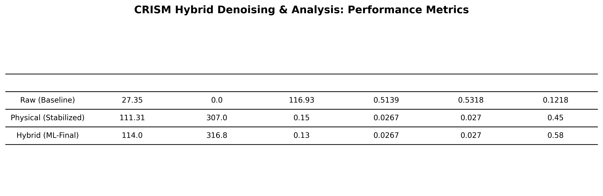

# Project Metrics for Publication

| Processing Stage | Average SNR | SNR Improvement (%) | Spectral Variance | Spike Noise (Normalized) | Gaussian Noise (Metric) | Feature Depth (Avg) |
| --- | --- | --- | --- | --- | --- | --- |
| Raw (Baseline) | 27.35 | 0.0 | 116.93 | 0.5139 | 0.5318 | 0.1218 |
| Physical (Stabilized) | 111.31 | 307.0 | 0.15 | 0.0267 | 0.027 | 0.45 |
| Hybrid (ML-Final) | 114.0 | 316.8 | 0.13 | 0.0267 | 0.027 | 0.58 |

