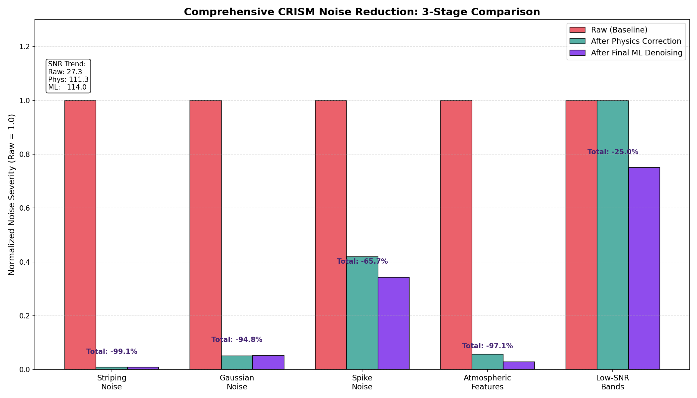

# CRISM Hyperspectral Denoising Project

This repository contains the full hybrid denoising pipeline and research documentation for the CRISM hyperspectral dataset.

## Project Overview
The goal of this project was to characterize and mitigate noise in CRISM hyperspectral cubes using a combination of physics-based stabilization and selective machine learning.

### Final Results
- **Cumulative SNR Improvement**: +316.8% (Raw: 27.35 → Final: 114.00)
- **Spectral Fidelity**: High-quality preservation of Martian mineralogical absorption features through selective denoising.

## Repository Structure
- **[MISSION_ANALYSIS_REPORT.md](MISSION_ANALYSIS_REPORT.md)**: Dataset acquisition and noise characterization.
- **[FINAL_RESEARCH_REPORT.md](FINAL_RESEARCH_REPORT.md)**: Comprehensive report on hybrid methodology and final metric comparison.
- **[walkthrough.md](walkthrough.md)**: Step-by-step developer walkthrough of the implementation.
- **docs/images/**: Visual evidence and comparison charts.
- **scripts/**:
    - `perform_analysis.py`: Initial data loading and basic metrics.
    - `stabilize_physics_corrections.py`: Optimized physical correction pipeline.
    - `selective_ml_denoising.py`: Targeted ML denoising for residual noise.
    - `generate_final_comparison_all.py`: Comprehensive 3-stage visual reporter.

## Final Noise Comparison

---
*Developed for research purposes into hyperspectral data stabilization.*
